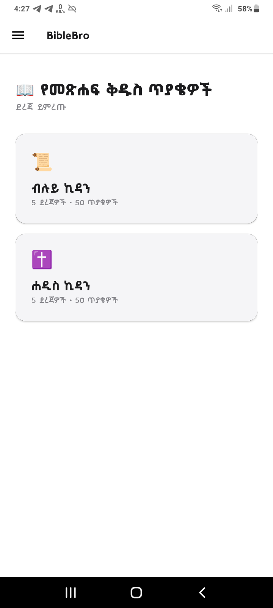
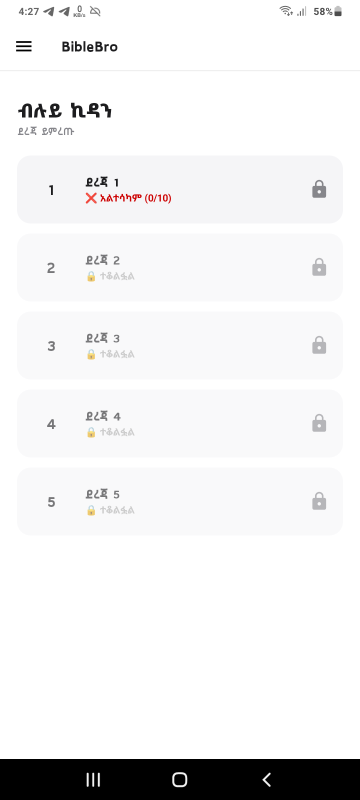
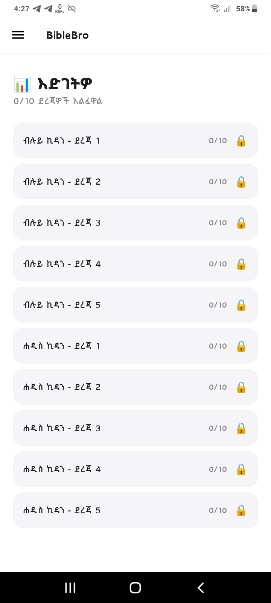
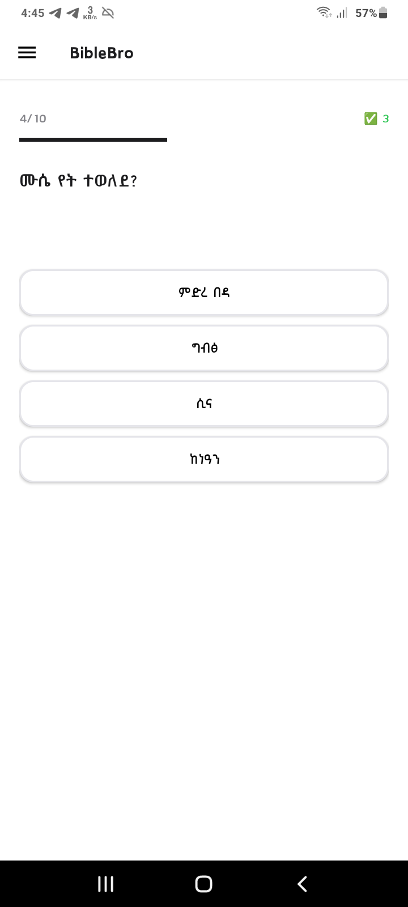

# 📖 BibleBro – Bible Quiz App

BibleBro is an interactive Bible quiz app designed to help you learn and test your knowledge of both the Old and New Testaments. With 200+ questions, dynamic shuffling, and progress tracking, it's the perfect tool for personal Bible study or group learning.

---

## ✨ Features

- **Both Testaments** – Old Testament and New Testament sections
- **5 Levels Each** – Progress through 5 difficulty levels per testament
- **20 Questions per Level** – 200+ total questions in the database
- **Smart Shuffling** – Questions and answer choices shuffle every attempt
- **Progress Tracking** – Saves your best score and pass/fail status
- **Pass to Unlock** – Score 6/10 to unlock the next level
- **Level Reattempt** – Failed levels reshuffle questions to prevent cheating
- **Clean UI** – Apple-style minimalist design with custom Amharic font

---

## 🛠️ Tech Stack

| Category             | Technology          |
|----------------------|---------------------|
| **Language**         | Kotlin              |
| **UI**               | XML Views           |
| **Progress Storage** | SharedPreferences   |
| **Architecture**     | MVVM pattern        |
| **Font**             | Shiromeda (Amharic) |

---

## 📸 Screenshots

### Home Screen


### Old Testament – Level Selection


### Progress Screen


### Quiz Screen


---

## 📥 Download & Installation

1. Clone the repository:
   ```bash
   git clone https://github.com/YoniCoder/BibleBro.git
2. Open the project in Android Studio.
3. Build and run on an Android device (API 24+).

**📚 What I Learned**

Building BibleBro taught me:
Database design for quiz applications
Question shuffling algorithms
Progress tracking with SharedPreferences
Amharic font integration
Navigation drawer implementation
Level unlock mechanics (score 6/10 to proceed)

**🚀 Future Improvements**
More questions per level
Multiple difficulty modes
Leaderboard
Timed challenges
Daily Bible verses
Multiplayer mode

**📧 Email: yonastedla06@gmail.com
📱 Phone: +251707106234
🔗 GitHub: [YoniCoder](https://github.com/YoniCoder)**
